# WYChart

[](http://cocoapods.org/pods/WYChart)
[](http://cocoapods.org/pods/WYChart)
[](http://cocoapods.org/pods/WYChart)
[](http://cocoapods.org/pods/WYChart)

A simple and elegant LineChart and pieChart library with rich animations.
More type of charts will come not long after.

<p align="center">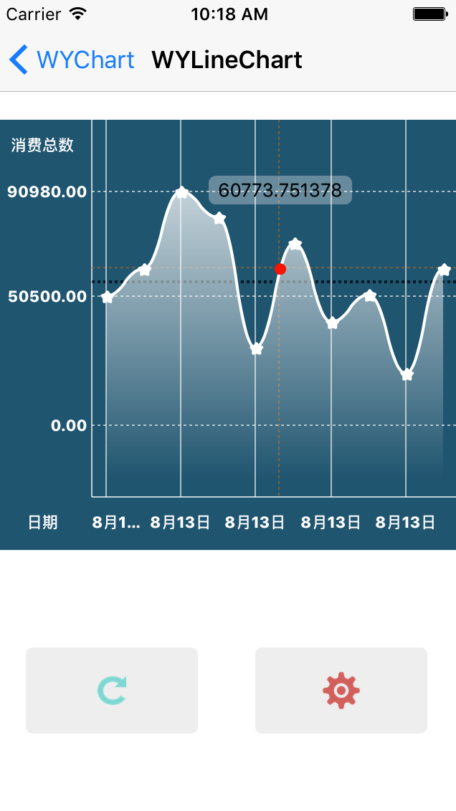</p> 
<p align="center">
<b>WYLineChart</b>
<p align="center">Make it easy to create a line chart, Scrollable, Pinchable, Animatable
</p>
</p>


<p align="center">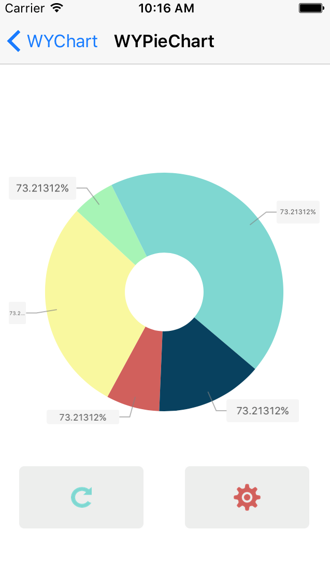</p> 
<p align="center">
<b>WYPieChart</b>
<p align="center">Make it easy to create a Pie chart, Rotatable, Draggable, Selectable, Animatable
</p>
</p>

***

**If you love WYChart , encourage me with a star 🌟 , thanks!**

**如果你喜欢WYChart , 给我一个星星🌟作为奖励 , 谢谢 ！**

**另外，关于WYChart技术及其它介绍的博文已开始撰写并逐步发布，👉[点击这里](http://blog.oneinbest.com/2016/10/11/WYChart%E4%BB%8B%E7%BB%8D%E7%B3%BB%E5%88%97-%E4%B8%80-%E6%A6%82%E8%A7%88/)，希望你能给出宝贵的意见。🍻🍻**


### 中文简介请点击 👉 [中文简介](https://github.com/GeorgeWang03/WYChart/blob/master/README.zh.md)

## Project

### Requirements

WYChart works on iOS7+, compatible with ARC.
Some Framework are required, as follow:  

- **Foundation.framework**
- **UIKit.framework**
- **QuartzCore.framework**
- **CoreGraphic.framework**

The frameworks above always included in most xcode project.

### License
WYChart is available under the [MIT license](LICENSE). See the LICENSE file for more info.
### Demo
The Project included a demo showing the tow chart and the code that how to use the chart with properties and methods.In perticalculer, there are setting pages for  two charts which you can change the property and see what changed. 
To run the example project, clone the repo, and run `pod install` from the Example directory first.
The demo page shows follow:
<p align="center">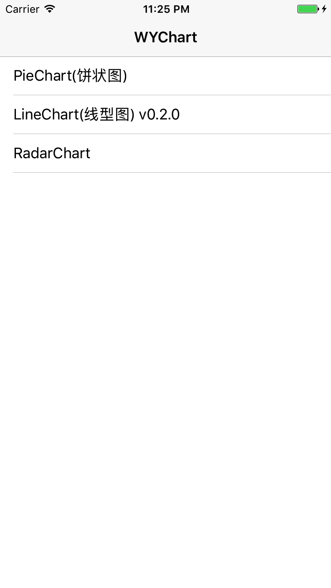</p> 
<p align="center">
<b>Main Table</b>
</p>

<p align="center">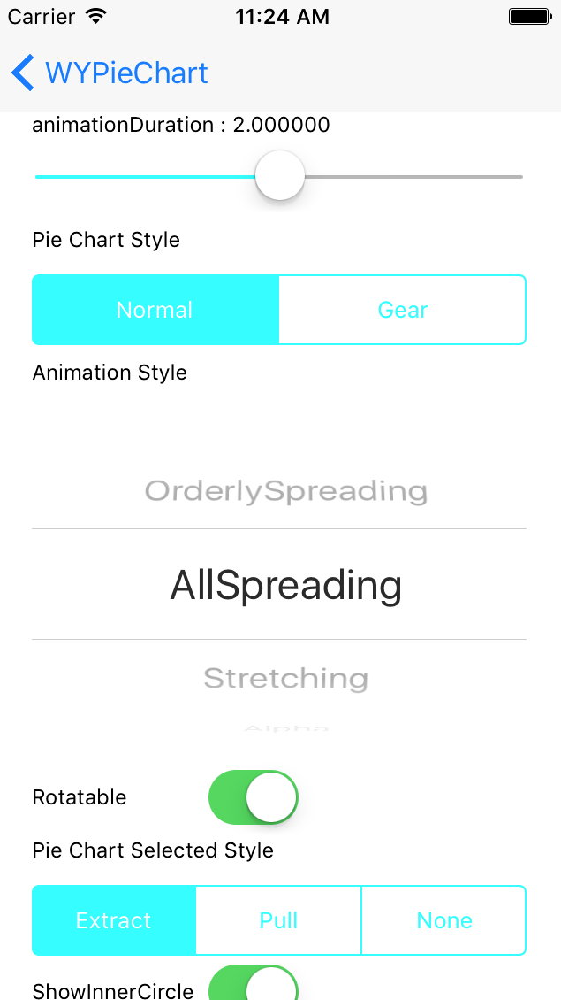</p> 
<p align="center">
<b>Pie Chart Setting Page</b>
</p>

<p align="center">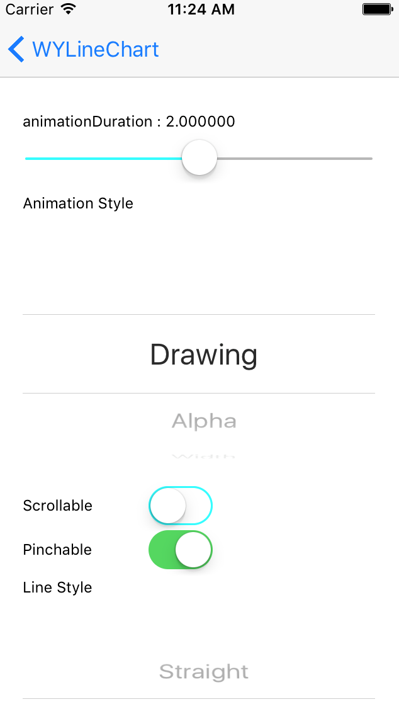</p> 
<p align="center">
<b>Line Chart Setting Page</b>
</p>

## Getting Started


### Installation


WYChart is available through [CocoaPods](http://cocoapods.org). To install
it, simply add the following line to your Podfile:

```ruby
pod "WYChart"
```

#### Cocoapods

To install WYChart in you project, just add the following line to you `podfile`:

<pre><code>pod 'WYChart'</code></pre>

then run following line in terminal:
<pre><code>pod install</code></pre>

#### Add floder
Just dragging the WYChart floder in your download project into you own project.

### Setup
WYChart design the interface like most Controls in UIKit.framework, such as UITableView, UICollection, you have to implemente the required delegate and dataSource method, and setting some essential property.

####First of all
Add the following line to you `.h` or `.m` file where you use the chart:
<pre><code>#import "WYLineChart.h"</code></pre>
or
<pre><code>#import "WYPieChart.h"</code></pre>

The follow lines will show you how to initialize WYLineChart and WYPieChart in different way.

#### WYLineChart

**First**, and following line to follow WYLineChartViewDelegate and WYLineChartViewDataSource:  

		@interface SomeViewController () <WYLineChartViewDelegate, WYLineChartViewDatasource>
		
**Second**, initilize instance for WYLineChartView:  

		_chartView = [[WYLineChartView alloc] initWithFrame:frame];
    	_chartView.delegate = self;
    	_chartView.datasource = self;  
    	  
**Third**, set the line chart data array, which contained numbers of WYLineChartPoint:  
		
		WYLineChartPoint *point = [[WYLineChartPoint alloc] init];
		point.value = 50503.134;
		[container addObject:point];
		point = [[WYLineChartPoint alloc] init];
		point.value = 60623.4;
		[container addObject:point];
		
		...
		
		_chartView.points = [NSArray arrayWithArray:_points];
      
**Finally**, add chart to controller`s view and update line chart:  

		[self.view addSubview:_chartView];  
		[_chartView updateGraph];
		
		  
Besides, you have to implement the required methods of delegate and dataSource:  

**Delegate** 
   
		- (NSInteger)numberOfLabelOnXAxisInLineChartView:(WYLineChartView *)chartView
		
		- (CGFloat)gapBetweenPointsHorizontalInLineChartView:(WYLineChartView *)chartView
		
		- (CGFloat)maxValueForPointsInLineChartView:(WYLineChartView *)chartView
		
		- (CGFloat)minValueForPointsInLineChartView:(WYLineChartView *)chartView

**DataSource**  

		- (NSString *)lineChartView:(WYLineChartView *)chartView contentTextForXAxisLabelAtIndex:(NSInteger)index
		
		- (WYLineChartPoint *)lineChartView:(WYLineChartView *)chartView pointReferToXAxisLabelAtIndex:(NSInteger)index

***
The jobs above is not enough, there are a lot of optional property for you to config the appearence and interaction of line chart.  

**Gradient Foreground**
</br>
To make the line chart more elegant, you can choose to add gradient foreground for it, add the following lines:  
  
		_chartView.gradientColors = @[[UIColor colorWithWhite:1.0 alpha:0.9],
                                  [UIColor colorWithWhite:1.0 alpha:0.0]];
    	_chartView.gradientColorsLocation = @[@(0.0), @(0.95)];
    	_chartView.drawGradient = YES;
    	  
That will show you a gradient foreground as following:

<p align="center"></p> 
<p align="center">
<b>Gradient Foreground</b>
</p>
</br>

Otherwise:

<p align="center">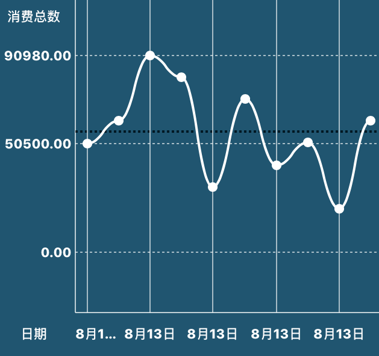</p> 
<p align="center">
<b>Without Gradient Foreground</b>
</p>

</br>
</br>

**Scrollabel**
</br>

WYLineChart support you to scroll to chart horizontally, just add the simple line following:  

		_chartView.scrollable = YES;  

Then, you can scroll the chart:

<p align="center"></p> 
<p align="center">
<b>Scroll Chart</b>
</p>

**Pinchable**
</br>

You can also add the following line:    

		_chartView.pinchable = YES;
		  
to make the chart pinchable, that\`s useful when you want to scale the data grade for chart to show, you can pinch out or pinch in to reload data, and the method `- (void)lineChartView:didEndedPinchGraphWithOption:` will be notified, in which you can reset the data array and update the chart.

**Line Style**

WYLineChart supports three line style:	  
  
		kWYLineChartMainStraightLine,
    	kWYLineChartMainBezierWaveLine,
    	kWYLineChartMainBezierTaperLine  

and if you do not want a line while just some point, you can choose `kWYLineChartMainNoneLine` 

<p align="center">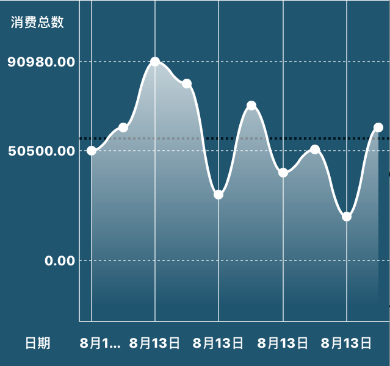</p> 
<p align="center">
<b>Wave Style</b>
</p>
</br>

<p align="center">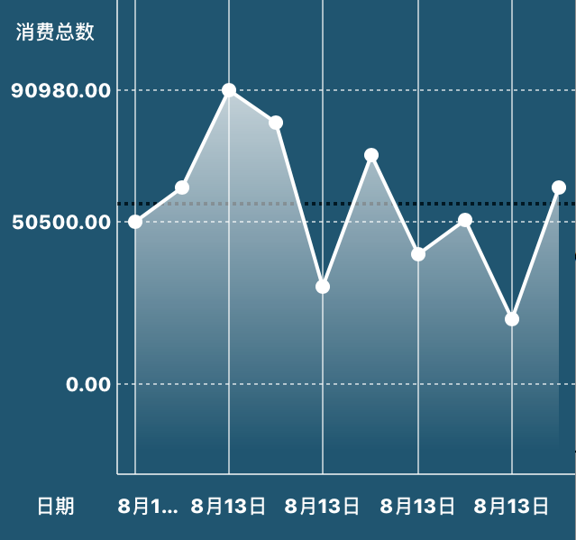</p> 
<p align="center">
<b>Straight Style</b>
</p>
</br>

<p align="center">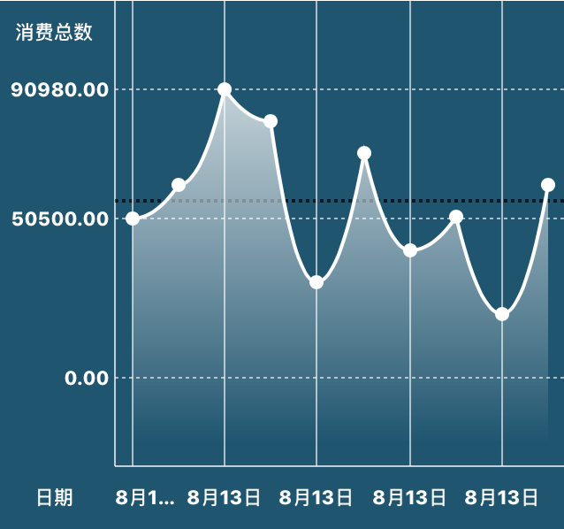</p> 
<p align="center">
<b>Tapper Style</b>
</p>
</br>

<p align="center">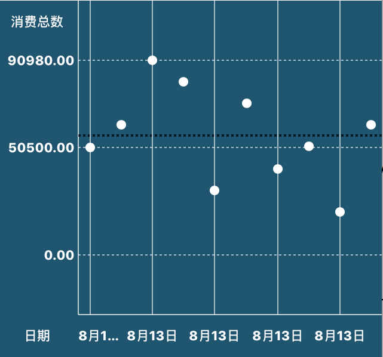</p> 
<p align="center">
<b>None Line</b>
</p>
</br>
		  
**Animation Style**

There are several animation for chart:  

		kWYLineChartAnimationDrawing,
    	kWYLineChartAnimationAlpha,
    	kWYLineChartAnimationWidth,
    	kWYLineChartAnimationRise,
    	kWYLineChartAnimationSpring,
    	kWYLineChartNoneAnimation


For example, `kWYLineChartAnimationDrawing` show as:
<p align="center"></p> 
<p align="center">
<b>Drawing Animation</b>
</p>    

and `kWYLineChartAnimationSpring` show as:
<p align="center">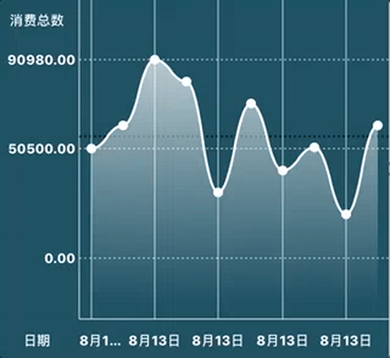</p> 
<p align="center">
<b>Spring Animation</b>
</p>  

**Junction Style**

You can choose a junction style bellowing:

		kWYLineChartJunctionShapeNone,
    	kWYLineChartJunctionShapeSolidCircle,
    	kWYLineChartJunctionShapeHollowCircle,
    	kWYLineChartJunctionShapeSolidSquare,
    	kWYLineChartJunctionShapeHollowSquare,
    	kWYLineChartJunctionShapeSolidRectangle,
    	kWYLineChartJunctionShapeHollowRectangle,
    	kWYLineChartJunctionShapeSolidStar,
    	kWYLineChartJunctionShapeHollowStar  
  
For example, `kWYLineChartJunctionShapeHollowRectangle` will show as:

<p align="center">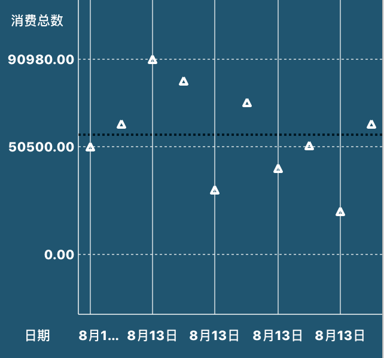</p> 
<p align="center">
<b>Hollow Rectangle</b>
</p>
</br>

**Touch Point/Line**

WYLineChart containe a long press gesture for a point to show where you touch on the line, and will return the point by the delegate method bellow:  

		- (void)lineChartView:didBeganTouchAtSegmentOfPoint:value:
		- (void)lineChartView:didMovedTouchToSegmentOfPoint:value:
		- (void)lineChartView:didEndedTouchToSegmentOfPoint:value:  
  
<p align="center"></p> 
<p align="center">
<b>Touch Point</b>
</p>
</br>  
    
There`re numbers of feature in WYLineChart, if you are intrested in it, see the [interface]("WYChart/WYLineChart/Main/WYLineChartView.h").

#### WYPieChart  


**First**, and following line to follow WYPieChartViewDelegate and WYPieChartViewDataSource:  

		@interface SomeViewController () <WYLineChartViewDelegate, WYLineChartViewDatasource>
		
**Second**, initilize instance for WYPieChartView:  

		_pieView = [[WYPieChartView alloc] initWithFrame:CGRectMake(0, 70, self.view.wy_boundsWidth, 300)];
    	_pieView.delegate = self;
    	_pieView.datasource = self;   

**Third**, set the pie chart data array, which contained numbers of pie`s value:  

		_pieView.values = @[@50, @200, @40, @300, @100];  

**Finally**, add chart to controller`s view and update pie chart:  

		[self.view addSubview:_pieView]; 
		[_pieView update];
		  
**Besides**, colors for sector is required by dataSource method `- (UIColor *)pieChartView:sectorColorAtIndex:`, you have to implement that method to dye your pieChart.
		
Like WYLineChart, there are also number of optional property for you to config the appearence and interaction of line chart.

**Pie Style**

You can choose style between `kWYPieChartNormalStyle` and `kWYPieChartGearStyle`, as showing below:

<p align="center">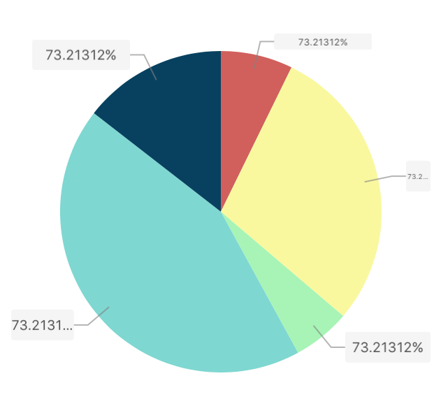</p> 
<p align="center">
<b>Normal Pie Style</b>
</p>
</br>  

<p align="center">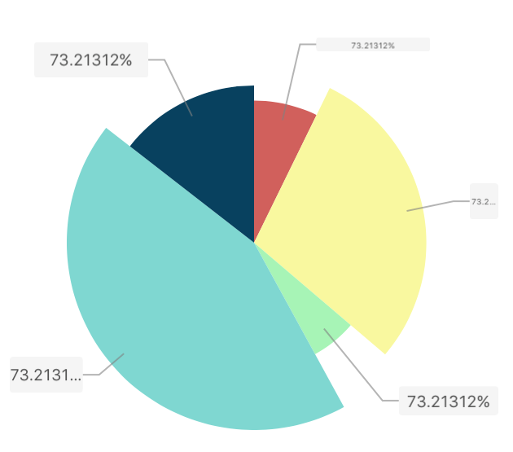</p> 
<p align="center">
<b>Gear Pie Style</b>
</p>
</br>  

Just add the following line when you initialize the pie chart:  
  
		_pieView.style = kWYPieChartNormalStyle/kWYPieChartGearStyle;  

**Rotatable**

If you want the pie chart to be more interactable, you can add the code below:  
  
		 _pieView.rotatable = YES;  
		 
to make it rotatable.  
  
<p align="center">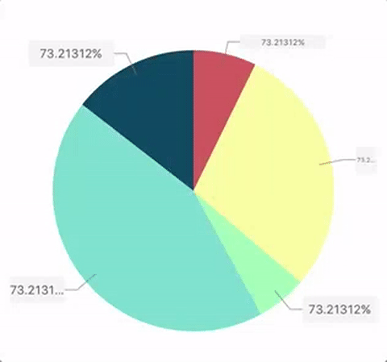</p> 
<p align="center">
<b>Pie Chart Rotatable</b>
</p>
</br> 

**Selected**

WYPieChart support you to select the sectors with two types of animation, and will call back to the delegate method `pieChartView:didSelectedSectorAtIndex:` when you selecting, you can choose selected type between `kWYPieChartSectorSelectedExtraction` and `kWYPieChartSectorSelectedPull` as below:  

		_pieView.selectedStyle = kWYPieChartSectorSelectedExtraction;  


<p align="center">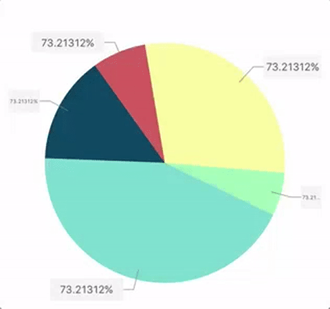</p> 
<p align="center">
<b>Extraction Style</b>
</p>
</br>  

<p align="center">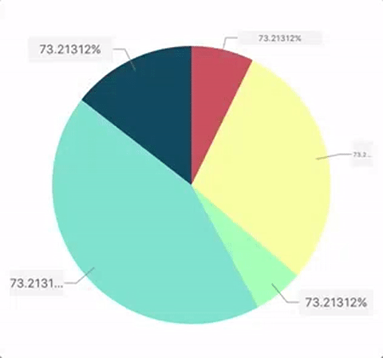</p> 
<p align="center">
<b>Pull Style</b>
</p>
</br>    

**Animation Style**

Six styles of animation you can choose to animation the pie chart when reloading:  
  
	kWYPieChartAnimationOrderlySpreading,
    kWYPieChartAnimationAllSpreading,
    kWYPieChartAnimationStretching,
    kWYPieChartAnimationAlpha,
    kWYPieChartAnimationScale  

For example, `kWYPieChartAnimationAllSpreading` style will show as below:

<p align="center"></p> 
<p align="center">
<b>All Spreading Style</b>
</p>
</br>    

You can select the other animation styles to see what it perform in the demo.

**Inner Circle**

The property `showInnerCircle` is define should a empty circle draw in the chart, which you can add a label on it, such as a sum label.

<p align="center">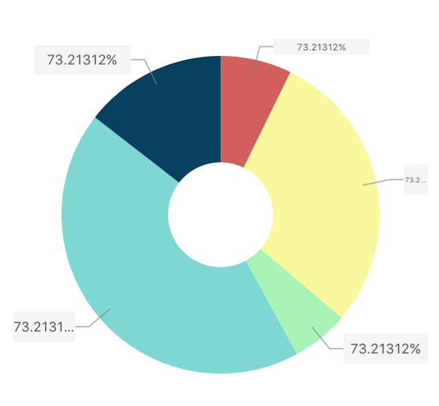</p> 
<p align="center">
<b>Inner Circle</b>
</p>
</br>     

**Gradient**

The `fillByGradient` property default is NO, if you set it to YES, every sector will fill by gradient.


<p align="center">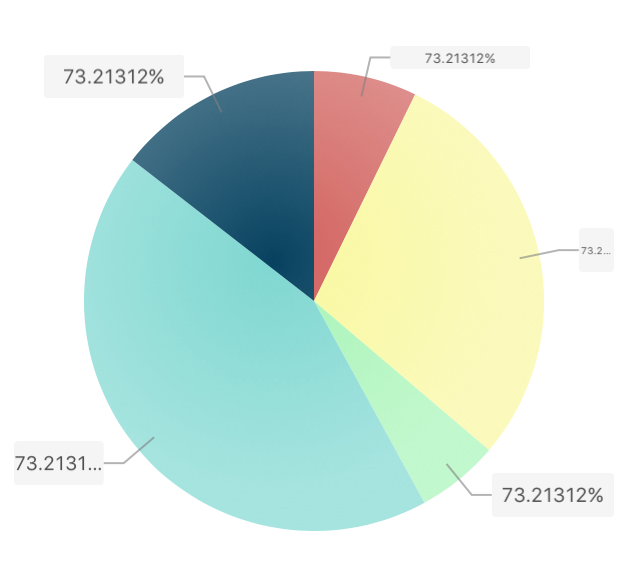</p> 
<p align="center">
<b>Gradient Fill</b>
</p>
</br>    

Some other feature also include in WYPieChart, you can find them in [PieChartView.h]("WYChart/WYLineChart/Main/WYLineChartView.h")
</br>
</br>
</br>
##Contact

If you have any problem or got an idear, i will be glad if share them to me by a `#issue` or [georgewang003@gmail.com](georgewang003@gmail.com), and this my [personal blog](http://blog.oneinbest.com) where you can find some technology about WYChart or any other topics.
