# WYChart

[](http://cocoapods.org/pods/WYChart)
[](http://cocoapods.org/pods/WYChart)
[](http://cocoapods.org/pods/WYChart)
[](http://cocoapods.org/pods/WYChart)

WYChart是一个简洁优雅的，集线性图和扇形图一体的图形库，有丰富的动画以及交互方式，在以后的版本会有更多类型的图形加入。

<p align="center">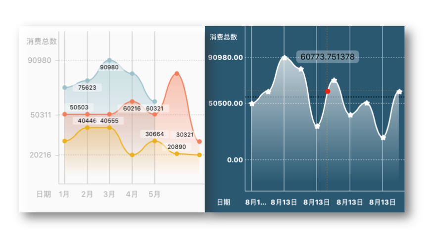</p> 
<p align="center">
<b>WYLineChart</b>
<p align="center">简单方便地创建可滑动、缩放、动画的线型图
</p>
</p>


<p align="center">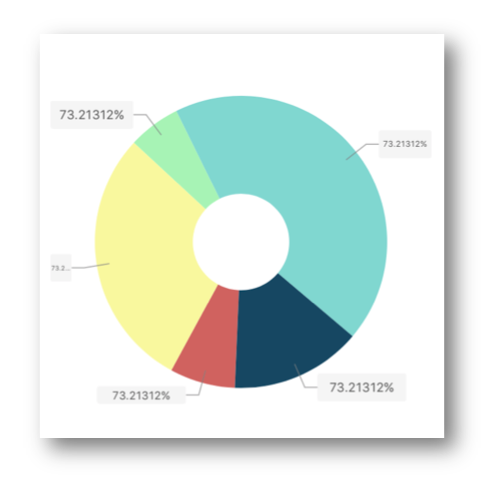</p> 
<p align="center">
<b>WYPieChart</b>
<p align="center">简单方便地创建可旋转、可拉动、可选中以及拥有动画的扇形图
</p>
</p>

<p align="center">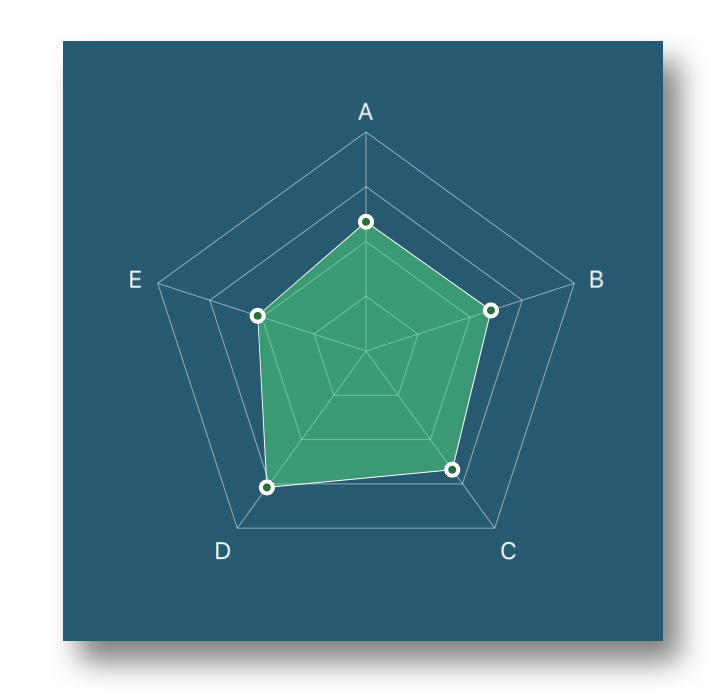</p> 
<p align="center">
<b>WYRadarChart</b>
<p align="center">简单方便地创建拥有动画的雷达图
</p>
</p>

***

**经过一段时间的改造，WYChart v0.2.0版本发布，线型图支持多线段**

**如果你喜欢WYChart , 给我一个星星🌟作为奖励 , 谢谢 ！**

README.md for English 👉 [README](README.md)

**另外，关于WYChart技术及其它介绍的博文已开始撰写并逐步发布，👉[点击这里](http://blog.oneinbest.com/2016/10/11/WYChart%E4%BB%8B%E7%BB%8D%E7%B3%BB%E5%88%97-%E4%B8%80-%E6%A6%82%E8%A7%88/)，希望你能给出宝贵的意见。🍻🍻**

## 项目

### 要求

WYChart 对要求系统iOS7以上, 兼容ARC.
下面的框架是编译时必须的:  

- **Foundation.framework**
- **UIKit.framework**
- **QuartzCore.framework**
- **CoreGraphic.framework**

以上部分框架一般新建项目时也会自动加入，如：Foundation.framework和UIKit.framework。

### 证书
WYChart 使用 [MIT license]("LICENSE") 证书. 详情见 LICENSE 文件.

### 例子
这个项目的例子展示如何通过头文件声明的属性和方法使用线型图和扇形图；值得注意的是还有两个设置页面分别用于两个图表属性设置，并可以实时看到图表的变化。
运行项目，先克隆或下载项目，然后运行在Example目录 `pod install` 。
例子效果图如下：

<p align="center"></p> 
<p align="center">
<b>主菜单</b>
</p>

<p align="center"></p> 
<p align="center">
<b>扇形图设置页面</b>
</p>

<p align="center">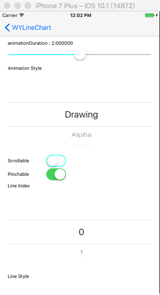</p> 
<p align="center">
</p>

<p align="center">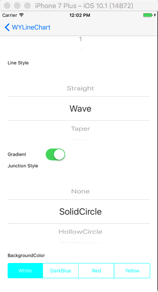</p> 
<p align="center">
<b>线型图设置页面</b>
</p>

## 开始


### 安装


WYChart 可以通过 [CocoaPods](http://cocoapods.org) 加入到你的项目中，安装时只要在你的 `Podfile` 文件添加以下内容：

```ruby
pod "WYChart"
```
也可以通过复制文件到项目目录

#### 复制文件
只要从你下载的项目中把WYChart文件夹复制到你的项目目录中可以。

### 部署
WYChart 接口设计和多数UIKit的控件一样，如UITableView、UICollectionView，你需要实现必须的代理方法和数据源方法，然后设置一些关键的属性。

####首先
把以下的内容添加到你使用**WYChart** `.h` 文件中：
<pre><code>#import "WYLineChart.h"</code></pre>
or
<pre><code>#import "WYPieChart.h"</code></pre>

下面的代码向你展示如何初始化WYLineChart 和 WYPieChart。

#### WYLineChart

**首先**, 添加 WYLineChartViewDelegate 和 WYLineChartViewDataSource两个协议:  

		@interface SomeViewController () <WYLineChartViewDelegate, WYLineChartViewDatasource>
		
**其次**, 初始化 WYLineChartView 实例:  

		_chartView = [[WYLineChartView alloc] initWithFrame:frame];
    	_chartView.delegate = self;
    	_chartView.datasource = self;  
    	  
**然后**, 设置线型图的数据数组，数组包含的是WYLineChartPoint类型的点：
		
		NSMutableArray *mutableArray = [NSMutableArray array];
		 // line_1
        NSArray *points = [WYLineChartPoint pointsFromValueArray:@[@(70706.89),@(75623.4),@(90980.f),@(80890.34),@(60321.2)]];
        [mutableArray addObject:points];
        // line_2
        points = [WYLineChartPoint pointsFromValueArray:@[@(50503.134),@(50446.85),@(50555.67),@(60216.48),@(50664.45),@(80890.34),@(30321.2)]];
        [mutableArray addObject:points];
		 // set data
        _lineChart.points = mutableArray;
        
在v0.2.0版本之后，lineChart.points 属性包含了一个或多个线段的点集，因此，数据结构也做了相应的改变，如同头文件`WYLineChartView.h`所描述的：

		// all the points of lines on the graph
		// the content should be:
		// /* points */@[
		//                  /* line 0 */ @[
		//                                 /* point 0 */ (WYLineChartPoint *)point0, point1, point2 ...
		//                                 ],
		//                  /* line 1 */ @[
		//                                 /* point 0 */ (WYLineChartPoint *)point0, point1, point2 ...
		//                                 ],
		//              ]
		// v0.2.0
      
**最后**, 添加图表到控制器的视图上并更新图表：

		[self.view addSubview:_chartView];  
		[_chartView updateGraph];
		
		  
其次，你必须实现协议要求的额代理方法和数据源方法：

**Delegate** 
   
		- (CGFloat)gapBetweenPointsHorizontalInLineChartView:(WYLineChartView *)chartView;

**DataSource**  

		- (NSString *)lineChartView:(WYLineChartView *)chartView contentTextForXAxisLabelAtIndex:(NSInteger)index
		
		- (WYLineChartPoint *)lineChartView:(WYLineChartView *)chartView pointReferToXAxisLabelAtIndex:(NSInteger)index

***
上面的工作还不够，有很多可选择的属性可以设置线型图的外观和交互方式。顺便说一下，在v0.2.0版本之后，设置线段的属性的方式通过字典集（NSDictionary 键值对)的方式，如果你要自定义线段的属性，比如线段的类型、线段的宽度等，你要实现数据源方法`- (NSDictionary *)lineChartView:(WYLineChartView *)chartView attributesForLineAtIndex:(NSUInteger)index;` 

**渐变前景**
</br>
**渐变前景**是一个可选的线段属性，要通过键名`kWYLineChartLineAttributeDrawGradient` 在上文提到的数据源方法中使用。
为了使线型图更佳好看，你可以选择添加渐变前景，只需要添加下面的代码：
  
	- (NSDictionary *)lineChartView:(WYLineChartView *)chartView attributesForLineAtIndex:(NSUInteger)index {
	
    NSMutableDictionary *resultAttributes = [NSMutableDictionary dictionary];
    resultAttributes[kWYLineChartLineAttributeDrawGradient] = @YES;
    
    ...
    // other line attributes config
    ...
    
    return resultAttributes;
	}
    	  
如下图，会有渐变前景出现：

<p align="center">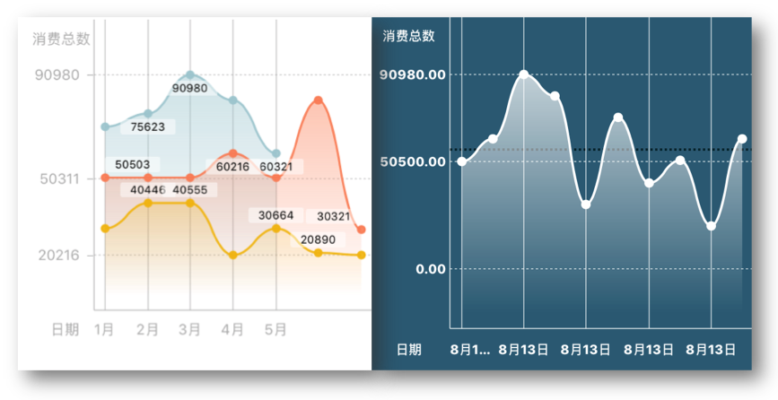</p> 
<p align="center">
<b>渐变前景</b>
</p>
</br>

没渐变情况:

<p align="center">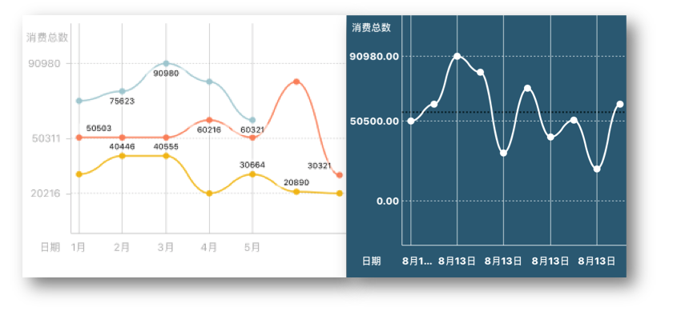</p> 
<p align="center">
<b>没渐变</b>
</p>

</br>
</br>

**可滑动**
</br>

WYLineChart 支持水平滑动，只需要添加下面的代码：

		_chartView.scrollable = YES;  

然后，你就可以滚动线型图：

<p align="center"></p> 
<p align="center">
<b>滚动线型图</b>
</p>

**可缩放**
</br>

你可以添加下面代码让线型图克缩放：

		_chartView.pinchable = YES;
		  
线型图可缩放很有用，当你有多个层级的数据想通过缩放来展示时，你可以向内捏或者向外扩展，然后方法`- (void)lineChartView:didEndedPinchGraphWithOption:`会被触发，你可以在里面重新设置数据数组并更新图表。

**线条风格**

线条风格是一个可选的线段属性，你可以通过数据源方法，使用键名`kWYLineChartLineAttributeLineStyle`来设置。
WYLineChart 支持以下三种风格的线条:	  
  
		kWYLineChartMainStraightLine（直线）,
    	kWYLineChartMainBezierWaveLine（波浪状）,
    	kWYLineChartMainBezierTaperLine（曲线尖状）  

如果你不想要有线条而只是一些点，你可以选择`kWYLineChartMainNoneLine` 类型

<p align="center"></p> 
<p align="center">
<b>波浪壮</b>
</p>
</br>

<p align="center"></p> 
<p align="center">
<b>直线状</b>
</p>
</br>

<p align="center"></p> 
<p align="center">
<b>曲线尖状</b>
</p>
</br>

<p align="center"></p> 
<p align="center">
<b>没线条</b>
</p>
</br>
		  
**动画风格**

动画风格不是一个线段的属性，是一个线型图的全局属性，一旦设置，所有线段的动画类型都一样。
线型图包含几种动画：

		kWYLineChartAnimationDrawing,
    	kWYLineChartAnimationAlpha,
    	kWYLineChartAnimationWidth,
    	kWYLineChartAnimationRise,
    	kWYLineChartAnimationSpring,
    	kWYLineChartNoneAnimation    

例如， `kWYLineChartAnimationDrawing` 如下：
<p align="center"></p> 
<p align="center">
<b>绘制类型动画</b>
</p>    

以及 `kWYLineChartAnimationSpring` 如下：
<p align="center"></p> 
<p align="center">
<b>弹簧动画</b>
</p>  
**<a name="JunctionStyle"></a>数据点形状**

你可以选择以下数据点形状的风格：

		kWYLineChartJunctionShapeNone（没数据点）,
    	kWYLineChartJunctionShapeSolidCircle（实心圆）,
    	kWYLineChartJunctionShapeHollowCircle（空心圆）,
    	kWYLineChartJunctionShapeSolidSquare（实心方形）,
    	kWYLineChartJunctionShapeHollowSquare（空心方形）,
    	kWYLineChartJunctionShapeSolidRectangle（实心三角形）,
    	kWYLineChartJunctionShapeHollowRectangle（空心三角形）,
    	kWYLineChartJunctionShapeSolidStar（实心星星）,
    	kWYLineChartJunctionShapeHollowStar（空心星星）  
  
例如，`kWYLineChartJunctionShapeHollowRectangle`风格如下：

<p align="center"></p> 
<p align="center">
<b>空心三角形</b>
</p>
</br>

**点击点／辅助线**

WYLineChart 包含一个长按手势，长按时会出现线上的实时数据点，并触发一下代理方法：

		- (void)lineChartView:didBeganTouchAtSegmentOfPoint:value:
		- (void)lineChartView:didMovedTouchToSegmentOfPoint:value:
		- (void)lineChartView:didEndedTouchToSegmentOfPoint:value:  
  
<p align="center"></p> 
<p align="center">
<b>长按点</b>
</p>
</br>  

**但是**，在v0.2.0版本之后，这个属性仅仅在图中之有一个线段的时候起作用。
    
**数据点标签**

在v0.2.0之后，线型图可以让你为每个数据点添加自定义文本的标签，只要实现数据源方法 `- (NSString *)lineChartView:(WYLineChartView *)chartView contextTextForPointAtIndexPath:(NSIndexPath *)indexPath`，如果你返回nil，那么对应indexPath的标签不会显示。
    
**WYLineChart**还有很多的特性，如果你有兴趣请查看[interface]("WYChart/WYLineChart/Main/WYLineChartView.h")。

#### WYPieChart  


**首先**, 添加 WYPieChartViewDelegate and WYPieChartViewDataSource 协议:  

		@interface SomeViewController () <WYLineChartViewDelegate, WYLineChartViewDatasource>
		
**其次**, 初始化 WYPieChartView 实例:  

		_pieView = [[WYPieChartView alloc] initWithFrame:CGRectMake(0, 70, self.view.wy_boundsWidth, 300)];
    	_pieView.delegate = self;
    	_pieView.datasource = self;   

**然后**, 设置扇形数据数组，其包含多个扇形数值：

		_pieView.values = @[@50, @200, @40, @300, @100];  

**最后**, 添加扇形到控制器的视图上并刷新图表：  

		[self.view addSubview:_pieView]; 
		[_pieView update];
		  
**另外**, 扇形的颜色要在数据源方法 `- (UIColor *)pieChartView:sectorColorAtIndex:` 中指定。
		

像 **WYLineChart** 一样，扇形图有很多可选属性供你选择，以设置扇形的外观和交互方式。

**扇形风格**

你可以选择 `kWYPieChartNormalStyle` 或 `kWYPieChartGearStyle` 风格的扇形，效果如下：

<p align="center"></p> 
<p align="center">
<b>正常风格扇形</b>
</p>
</br>  

<p align="center"></p> 
<p align="center">
<b>齿轮状扇形</b>
</p>
</br>  

当你设置扇形风格时只需添加下面代码：
  
		_pieView.style = kWYPieChartNormalStyle/kWYPieChartGearStyle;  

**可旋转**

如果你想要让你的扇形图交互性更强，你可以添加下面的代码，让扇形可旋转：
  
		 _pieView.rotatable = YES;  
		 
  
<p align="center"></p> 
<p align="center">
<b>旋转扇形图</b>
</p>
</br> 

**可旋转**

WYPieChart 有两种方式让你选中扇块，并触发代理方法`pieChartView:didSelectedSectorAtIndex:`，你可以选择`kWYPieChartSectorSelectedExtraction` 或者 `kWYPieChartSectorSelectedPull` 的选中效果：

		_pieView.selectedStyle = kWYPieChartSectorSelectedExtraction;  


<p align="center"></p> 
<p align="center">
<b>弹出选中</b>
</p>
</br>  

<p align="center"></p> 
<p align="center">
<b>拉扯选中</b>
</p>
</br>    

**动画风格**

扇形图有6种刷新动画可以选择： 
  
	kWYPieChartAnimationOrderlySpreading,
    kWYPieChartAnimationAllSpreading,
    kWYPieChartAnimationStretching,
    kWYPieChartAnimationAlpha,
    kWYPieChartAnimationScale  

例如，`kWYPieChartAnimationAllSpreading` 效果如下：

<p align="center"></p> 
<p align="center">
<b>一次性展开</b>
</p>
</br>    

在项目例子中，你可以选择其它的动画风格，看看有什么效果。

**内嵌圆**

属性 `showInnerCircle` 用于表面扇形是否为实心，也就是是否中心有留空圆，如果留空，你可以在上面添加一些标签，如总数标签。

<p align="center"></p> 
<p align="center">
<b>内嵌圆</b>
</p>
</br>     

**渐变**

属性`fillByGradient`默认是`NO`，如果你设置它为`YES`，每个扇块会以渐变填充。


<p align="center"></p> 
<p align="center">
<b>渐变填充</b>
</p>
</br>    

扇型图其它的特性，你可以查看 [PieChartView.h]("WYChart/WYLineChart/Main/WYLineChartView.h")
</br>
</br>
</br>

####WYRadarChart

**首先，** 让一个类实现 `WYRadarChartViewDataSource `协议

```objc
@interface SomeClass <WYRadarChartViewDataSource>
```
**其次,** 创建 `WYRadarChartDimension`实例, 用于描述统计数据的维度，决定了雷达图中角的个数.

```objc
self.dimensions = [NSMutableArray new];
for (NSInteger index = 0; index < self.dimensionCount; index++) {
    WYRadarChartDimension *dimension = [WYRadarChartDimension new];
    dimension.title = @"title";
    dimension.titleColor = [UIColor whiteColor];
    [self.dimensions addObject:dimension];
}
```

**然后，** 用dimension实例数组创建 `WYRadarChartView` 实例，并指定dataSource.

```objc
self.radarChartView = [[WYRadarChartView alloc] initWithFrame:CGRectMake(0, 0, 100,100)
                                                   dimensions:self.dimensions
                                                     gradient:1];
self.radarChartView.dataSource = self;
```

**最后,** 你能改变 `WYRadarChartView`的UI属性, 比如 
`gradient `(决定了雷达图中同心环形的个数，至少是1，即最外圈的环形), `lineWidth `, `lineColor `. 然后用`reloadData` 或 `reloadDataWithAnimation:duration:`刷新UI

----------
**数据维度**

Radar chart view must be created with dimension array.
<p align="center">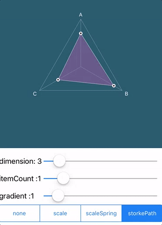</p> 
<p align="center">
<b>dimension</b>
</p>
</br>  

**数据实例**

从datasource获取数据实例`WYRadarChartItem `，并设置`WYRadarChartItem `的UI属性

```objc
self.items = [NSMutableArray new];
for (NSInteger index = 0; index < self.itemCount; index++) {
    WYRadarChartItem *item = [WYRadarChartItem new];
    NSMutableArray *value = [NSMutableArray new];
    for (NSInteger i = 0; i < self.dimensionCount; i++) {
        [value addObject:@(arc4random_uniform(100)*0.01)];
    }
    item.value = value;
    item.borderColor = [UIColor wy_colorWithHex:0xffffff];
    item.fillColor = [UIColor wy_colorWithHex:arc4random_uniform(0xffffff) alpha:0.5];
    item.junctionShape = kWYLineChartJunctionShapeSolidCircle;
    [self.items addObject:item];
}

#pragma mark - WYRadarChartViewDataSource

- (NSUInteger)numberOfItemInRadarChartView:(WYRadarChartView *)radarChartView {
    return self.items.count;
}

- (WYRadarChartItem *)radarChartView:(WYRadarChartView *)radarChartView itemAtIndex:(NSUInteger)index {
    return self.items[index];
}

- (id<WYRadarChartViewItemDescription>)radarChartView:(WYRadarChartView *)radarChartView descriptionForItemAtIndex:(NSUInteger)index {
    return nil;
}
```
<p align="center">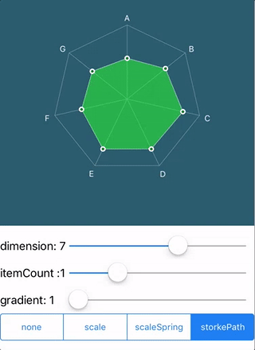</p> 
<p align="center">
<b>Item</b>
</p>
</br>  

**Gradient**

```objc
self.radarChartView.gradient = self.gradient;
[self.radarChartView reloadDataWithAnimation:self.animation duration:kAnimationDuration];
```
<p align="center">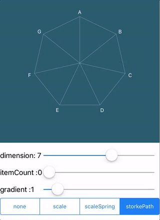</p> 
<p align="center">
<b>Gradient</b>
</p>
</br>  

**动画**

reload with aniamtion and animation duration.

```objc
typedef NS_ENUM(NSUInteger, WYRadarChartViewAnimation) {
    WYRadarChartViewAnimationNone,
    WYRadarChartViewAnimationScale,
    WYRadarChartViewAnimationScaleSpring,
    WYRadarChartViewAnimationStrokePath
};

[self.radarChartView reloadDataWithAnimation:self.animation duration:kAnimationDuration];
```
<p align="center">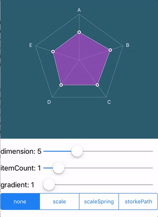</p> 
<p align="center">
<b>All Spreading Style</b>
</p>
</br>  

**数据点形状**

数据点的形状可通过 `WYRadarChartItem`实例的`junctionShape ` 属性来设置，与 [WYLineChart的数据点样式](#JunctionStyle)一致

```objc
/*
 *  default is kWYLineChartJunctionShapeNone
 */
@property (nonatomic, assign) WYLineChartJunctionShapeStyle junctionShape;
```

##特性

###v0.2.0
* **支持同一个线图多条线段**
* **支持每个数据点显示自定义内容高的标签**
* **使用字典（键值对）来设置线段的外观，取代以往通过属性设置的方式**

###v0.1.2
* **修补bug：扇型图更换数据的时候刷新奔溃**

###v0.1.1
* **修补bug：线型图中X轴标签的数量未能和点的数量相同**

###v0.1.0 (第一次发布)
* **加入线型图和扇型图**
* **线型图包含多种动画类型，如绘制，弹簧和上文介绍到的更多动画**
* **线型图包含多种线条形状，如波浪贝塞尔、尖峰贝塞尔和直线**
* **扇型图包含两种类型，正常圆形以及锯齿状扇形**
* **扇型图包含多种动画类型，如弹簧、缩放以及上文介绍到的其它动画**
* **扇型图包含两种交互方式，选择和拉动**

##联系方式

如果你有任何问题或者有一些建议，我很期待你分享给我，可以在issue区发表或者发到我的邮箱[georgewang003@gmail.com](georgewang003@gmail.com)，这个👉[personal blog](http://blog.oneinbest.com)是我的个人博客，我会在上面发布一些关于WYChart技术的文章或其它的文章，谢谢！